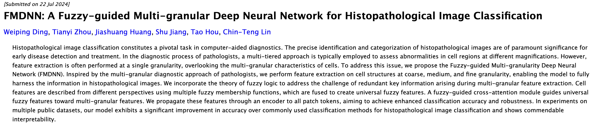

<p align="center">
  
</p>
<p align="center">
    <a href="XXX" target="_blank">Website</a> | <a href="xxx" target="_blank">Paper</a> | <a href="xxx" target="_blank">Data</a> <br>
</p>

---

## The CHIMERA knowledge base

CHIMERA is knowledge base of over 28K _real_ scientific recombination examples.
Recombination is the process of creating original ideas by integrating elements of existing mechanisms and concepts. For
example, taking inspiration from nature to design new technologies.

We build CHIMERA by automatically extracting examples of "recombination in action" from the scientific literature:


You are welcome to use CHIMERA to study recombination in science, develop new algorithms, or for any other purpose!
Make sure to cite our paper as described [here](#Citation).

## Getting Started

A quick start guide to get you up and running with the code.

### Installation

1. Clone this repository:
   ```bash
   git clone https://github.cs.huji.ac.il/tomhope-lab/CHIMERA.git
   ```
2. Create and activate a virtual environment:
   ```bash
   python3 -m venv myenv
   source ./myenv/bin/activate
   ```
3. Install dependencies:
   ```bash
   pip install -r requirements.txt
   ```

### Setting up API keys

Some of the code requires access to external APIs. You will need to set an OpenAI API key and a HuggingFace API key as
follows:

1. Get the keys (if you don't have them already):
    * [OpenAI API key](https://platform.openai.com/docs/api-reference/authentication)
    * [HuggingFace API key](https://huggingface.co/docs/hub/security-tokens)
2. Set up the keys:
   ```bash
   echo "your-openai-api-key" > openai_api_key
   echo "your-huggingface-api-key" > huggingface_api_key
   ```
   `openai_api_key` and `huggingface_api_key` are the default names of the files where the code will look for the keys.
   Both should be located in the project root directory.

### External dependencies

Some code uses external dependencies that are not included in this repository. You will need to clone them separately.

#### RankGPT

We use [RankGPT](https://github.com/sunnweiwei/RankGPT) to improve our base recombination prediction model. Set it up by
first cloning the directory:

```bash
git clone https://github.com/sunnweiwei/RankGPT.git
````

We modify the default ranker prompt to better align with our task. You can do the same by changing the
prompt [here](https://github.com/sunnweiwei/RankGPT/blob/0d62bc3855c7c118048a7c47c18e719b938e291a/rank_gpt.py#L143) as
follows:

```python
def get_prefix_prompt(query, num):
    return [
        {'role': 'user',
         'content': f"I have a scientific query describing settings and requesting a suggestion. I will provide you with {num} suggestions, each indicated by number identifier [].\nRank the suggestions based on their potential usefulness in addressing the query: {query}."},
        {'role': 'assistant', 'content': 'Okay, please provide the passages.'}]


def get_post_prompt(query, num):
    return f"Scientific Query: {query}. \nRank the {num} suggestions above based on their potential usefulness in addressing the query. The suggestions should be listed in descending order using identifiers. The most relevant suggestions should be listed first. The output format should be [] > [], e.g., [1] > [2]."
```

#### GoLLIE

[GoLLIE](https://github.com/hitz-zentroa/GoLLIE) is a zero-shot extraction model that we use as a baseline for our
extraction task. You would only need to install
it in case you want to reproduce our extraction experiment. In that case, simply clone the repository:

```bash
git clone https://github.com/hitz-zentroa/GoLLIE.git
```

#### mistal-finetne

We use [mistral-finetune](https://github.com/mistralai/mistral-finetune) to train our Mistral-based models. In case you
want use our training code, you would have to clone the repository first as follows:

```bash
https://github.com/mistralai/mistral-finetune.git
```

and follow the repo setup instructions.

## Demos

### Recombination extraction

1. Download Mistral base model weights from [huggingface](https://huggingface.co/noystl/mistral-base-model/tree/main).
2. Download the LoRA checkpoint from [huggingface](https://huggingface.co/noystl/mistral-e2e).
3. Run the extraction demo:
   ```bash
   python3 src/demo/recombination_extraction.py \
    --input_path src/demo/extraction_input_example.txt \ # path to a text file containing the input abstract
    --output_dir extraction_demo_out \
    --base_model_path mistral_base_model \ # base model path
    --extraction_model_path models/extraction_models/checkpoints/mistral_e2e # path to the LoRA checkpoint
   ```

`scripts/run_extraction_demo.sh` would run the demo with a default input file, containing the
following [abstract](https://arxiv.org/abs/2407.15312):


And should result in the following output:

```bash
Recombination extracted:
{
  "type": "inspiration",
  "entities": {
    "inspiration-src": [
      "the multi-granular diagnostic approach of pathologists"
    ],
    "inspiration-target": [
      "Histopathological image classification"
    ]
  }
}
```

### Recombination prediction

**Important**: Make sure to set up the OpenAI API key as described [here](#setting-up-api-keys) and RankGPT as
described [here](#rankgpt) before running this code.

1. Download our recombination prediction model
   from [huggingface](https://huggingface.co/noystl/recomb-pred-all-mpnet-base).
2. Set your input. We provide a default input file in `src/demo/prediction_demo_example.json` that contains the
   following example:
    ```text
      "context": "The need for improved factuality in scientific summarization is evident,
                  as existing methods may not adequately address the accuracy of statements.
                  This highlights a gap in the ability to effectively refine summaries through
                  feedback mechanisms that incorporate both positive and negative information.",
      "recombination_type": "inspiration",
      "anchor": "A scientific summarization method"
    ```
3. Execute `scripts/run_recombination_prediction_demo.sh` to run the prediction demo. Adjust the parameters as needed:
   ```bash
   python3 src/demo/recombination_prediction.py \
     --input_path "src/demo/prediction_demo_example.json" \ # path to a json file containing the input
     --entities_path "data/CHIMERA/entities_text.csv" \
     --output_path "prediction_demo_out" \
     --test_candidates_path "data/recombination_prediction_data/entities_after_cutoff.txt" \
     --weights_precision 32 \
     --model_name "sentence-transformers/all-mpnet-base-v2" \
     --checkpoint 'models/pred_models/all-mpnet-base' # path to the prediction model checkpoint
   ```

The output for the default input should look like this:

```text
============QUERY============
The need for improved factuality in scientific summarization is evident, as existing methods
may not adequately address the accuracy of statements. This highlights a gap in the ability
to effectively refine summaries through feedback mechanisms that incorporate both positive
and negative information.

What would be a good source of inspiration for "A scientific summarization method"?
============TOP-10-SUGGESTIONS============
1. fact-checking process
2. the peer review systems widely used in academic publication process
3. the academic peer review process
4. Human meta-reviewers
5. contrastive analysis of correct and incorrect answers
6. automatic reframing of disagreeing responses
7. the 'summarizing mistakes' strategy
8. a procedure of document generation and self-assessment
9. the task of survey paper review
10. human proofreading workflow
```

**Note**: We design this script to allow experimenting with the model, and you can use any context or anchor node you
want. However, note that it doesn't perform prediction in
the [filtered setting](https://api.semanticscholar.org/CorpusID:211241737) used in the paper, and results may vary.
Please see the [reproduction section](#prediction-experiments) to reproduce our experiments.

## Reproducing paper results

This part describe how to reproduce the results presented in our paper.

### Recombination extraction

1. Unzip the data: `unzip data/recombination_extraction_data.zip -d data/`
2. Reproduce zero-shot baselines (GPT-4o, GoLLIE) results:
    * Run the relevant script from `scripts/extraction_experiments/`.
3. Reproduce Mistral-based baselines results:
    * Download the base model weights for Mistral 7B Instruct v3
      from [huggingface](https://huggingface.co/noystl/mistral-base-model/tree/main) or
      [mistral-finetune](https://github.com/mistralai/mistral-finetune/tree/main?tab=readme-ov-file) and keep it
      in under `mistral_base_model` in the project root directory.
    * Download the relevant LoRA checkpoints from Huggingface.
        * [mistral-e2e](https://huggingface.co/noystl/mistral-e2e)
        * [mistral-abstract-classifier](https://huggingface.co/noystl/mistral_abstract_classifier)
        * [mistral-abstract-classifier-cot](https://huggingface.co/noystl/mistral-abstract-cot-classifier)
    * Run `scripts/extraction_experiments/run_mistral_baselines.sh`. Make sure to verify
      that `tokenizer_path`, `lora_path` and `trained_model_path` match the location of the LoRA checkpoints.
4. Reproduce Llama results:
    * Download the model checkpoint from [huggingface](https://huggingface.co/noystl/llama-8b-e2e).
    * Adjust the `checkpoint` parameter in `scripts/extraction_experiments/run_llama_e2e.sh` and run the script.
5. Reproduce ScBERT-based token classifier results:
    * Download the model checkpoint from [huggingface](https://huggingface.co/noystl/scibert_token_classifier).
    * Adjust the `checkpoint` path in `scripts/extraction_experiments/run_token_classifier.sh` and run the script.
6. We use the [PURE repository](https://github.com/princeton-nlp/PURE) to train and run inference for PURE in a separate
   environment, as it requires python 3.7 and isn't compatible with the rest of the code.

### Knowledge base analysis

Run the following to generate the tables and csv files used to create the analysis figures in the paper.

1. Unzip the data: `unzip data/CHIMERA.zip -d data/`
2. Run the analysis script:
   ```bash
   chmod +x scripts/analyse_kb.sh
   ./scripts/analyse_kb.sh
   ```

### Prediction experiments

1. Unzip the data: `unzip data/recombination_prediction_data.zip -d data/`
2. All trained models checkpoints are available
   on [huggingface](https://huggingface.co/collections/noystl/chimera-prediction-models-67f8fa1ccf2cf48e8fb1d077).
   Download them in case you want to reproduce results for fine-tuned models.
3. Run `scripts/prediction_experiments/run_ranker.sh` to reproduce ranking results. Change the arguments as follows to
   reproduce different settings (models, zero-shot, etc.):
   ```bash
   python3 src/experiments/recombination_prediction/finetune_sent_transformer_biencoder.py \
     --train_path "data/recombination_prediction_data/train.csv" \
     --test_path "data/recombination_prediction_data/test.csv" \
     --valid_path "data/recombination_prediction_data/valid.csv" \
     --entities_path "data/CHIMERA/entities_text.csv" \
     --output_path "sentence_transformers_link_prediction_res" \
     --nr_negatives 30 \
     --all_edges_path "data/recombination_prediction_data/all.csv" \
     --test_candidates_path "data/recombination_prediction_data/entities_after_cutoff.txt" \
     --valid_candidates_path "data/recombination_prediction_data/entities_before_cutoff.txt" \
     --model_name "sentence-transformers/all-mpnet-base-v2" \ # Either "BAAI/bge-large-en-v1.5", "intfloat/e5-large-v2" or "sentence-transformers/all-mpnet-base-v2"
     --num_train_epochs 3 \
     --batch_size 64 \
     --learning_rate 2e-5 \
     --warmup_ratio 0.1 \
     --encode_batch_size 1024 \
     --weights_precision 32 \
     --checkpoint ''\  # path to a checkpoint to load, remove if training from scratch 
     --zero_shot       # loads the provided checkpoint or base model and runs evaluation.
   ```

4. To run the reranker, you should first get the results path from the ranker log. The relevant line should look like
   this:

   ```
   Wrote results to sentence_transformers_link_prediction_res/<model>_zero_shot_<date>/results.json
   ```

5. Now, run `scripts/prediction_experiments/run_reranker.sh` to reproduce reranking results. Make sure to change
   the `biencoder_results` argument to the path you got from the ranker log.

   ```bash
   python3 src/experiments/recombination_prediction/reranker.py \
     --biencoder_results "" \
     --output_dir "reranker_out" \
     --openai_engine "gpt-4o" \
     --rank_gpt_window_size 10 \
     --rank_gpt_step_size 5 \
     --top_k 20 \
     --perform_checkpoint_at 500
   ```

   Note that we change adjust the RankGPT prompt locally, as described [here](#rankgpt). Your results might vary
   slightly in case you skip this step.

#### User study

1. Use `scripts/user_study_data_prep/run_user_study_baselines.sh` to rerun all user study
   baselines (except ours, see running instructions [here](#prediction-experiments)).
2. Fill in the baselines results paths in `src/experiments/recombination_prediction/user_study/baselines_results.json`
3. Run `scripts/user_study_data_prep/prep_user_study_data.sh` to prepare the user study data.

We performed the study using a streamlit-built platform. The code for batching the data and assigning it to users, the
annotation platform, and responses analysis is available [here](https://github.com/noy-sternlicht/myProject/tree/main).

## Citation

If you use this code or data in your research, please cite our paper:

```bibtex
@article{author2025paper,
  title={Paper Title},
  author={Last, First and Coauthor, Another},
  journal={Journal Name},
  volume={X},
  number={Y},
  pages={ZZ--ZZ},
  year={2025},
  publisher={Publisher}
}
```

## Authors

* [Noy Sternlicht](https://x.com/NoySternlicht)
* [Tom Hope](https://tomhoper.github.io/)
