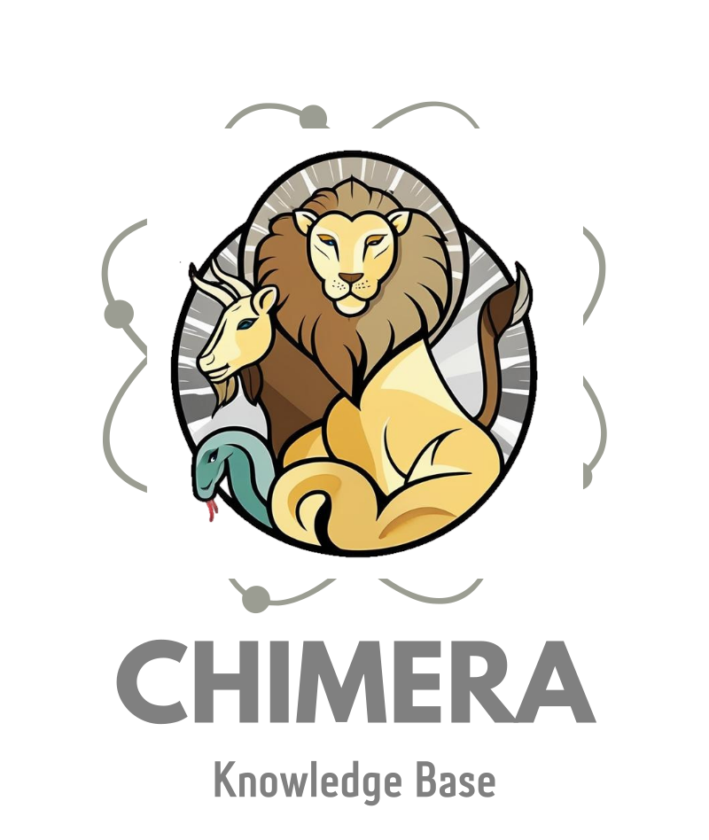

<p align="center">
  
</p>
<p align="center">
    <a href="XXX" target="_blank">Website</a> | <a href="xxx" target="_blank">Paper</a> | <a href="xxx" target="_blank">Dataset</a> <br>
</p>

---
## The CHIMERA knowledge base
CHIMERA is knowledge base of over 28K _real_ scientific recombination examples.
Recombination is the process of creating original ideas by integrating elements of existing mechanisms and concepts. For
example, taking inspiration from nature to design new technologies:


We build CHIMERA by automatically extracting examples of "recombination in action" from the scientific literature. You
are welcome to use CHIMERA to study recombination in science, develop new algorithms, or for any other purpose!
Make sure to cite our paper as described [here](#Citation).

## Getting Started

### Installation

```bash
# Clone this repository
git clone https://github.cs.huji.ac.il/tomhope-lab/CHIMERA.git

# Create and activate a virtual environment
python3 -m venv myenv
source ./myenv/bin/activate

# Clone external dependencies
git clone https://github.com/sunnweiwei/RankGPT.git

# Install dependencies
pip install -r requirements.txt
```

### Setting up the OpenAI API
Our recombination prediction model requires an OpenAI API key. You can set it up by following the
instructions [here](https://beta.openai.com/docs/developer-quickstart/).
After you have the API key, create a simple text file `openai_api_key` in the root directory of the project and paste
the key there. The code will automatically read the key from this file.


## Recombination extraction
TODO

## Recombination prediction
TODO

## Reproducing paper results
This part describe how to reproduce the results presented in our paper.

### Setup
1. Clone external dependencies:
   ```bash
   git clone https://github.com/mistralai/mistral-finetune.git
   git clone https://github.com/hitz-zentroa/GoLLIE.git
   ```
2. Some experiments require an HuggingFace API key. Set it up by creating a file `huggingface_api_key` and put it there. The code will automatically read the key from this file.
3. In addition, make sure you have set up the OpenAI API key as described [here](#setting-up-the-openai-api
).


### Recombination extraction

1. Unzip the data: `unzip data/recombination_extraction_data.zip -d data/`
2. Reproduce zero-shot baselines (GPT-4o, GoLLIE) results:
    * Run the relevant script from `scripts/extraction_experiments/`.
3. Reproduce Mistral-based baselines results:
    * Download the base model weights for Mistral 7B Instruct v3
      from [Huggingface](https://huggingface.co/noystl/mistral-base-model/tree/main) or
      [mistral-finetune](https://github.com/mistralai/mistral-finetune/tree/main?tab=readme-ov-file) and keep it
      in under `mistral_base_model` in the project root directory.
    * Download the relevant LoRA checkpoints from Huggingface.
        * [mistral-e2e](https://huggingface.co/noystl/mistral-e2e)
        * [mistral-abstract-classifier](https://huggingface.co/noystl/mistral_abstract_classifier)
        * [mistral-abstract-classifier-cot](https://huggingface.co/noystl/mistral-abstract-cot-classifier)
    * Run `scripts/extraction_experiments/run_mistral_baselines.sh`. Make sure to verify
      that `tokenizer_path`, `lora_path` and `trained_model_path` match the location of the LoRA checkpoints.
4. Reproduce Llama results:
    * Download the model checkpoint from [Huggingface](https://huggingface.co/noystl/llama-8b-e2e).
    * Adjust the `checkpoint` parameter in `scripts/extraction_experiments/run_llama_e2e.sh` and run the script.
5. Reproduce ScBERT-based token classifier results:
    * Download the model checkpoint from [Huggingface](https://huggingface.co/noystl/scibert_token_classifier).
    * Adjust the `checkpoint` path in `scripts/extraction_experiments/run_token_classifier.sh` and run the script.
6. We use [PURE](https://github.com/princeton-nlp/PURE) to train and run inference in a separate environment, as it
   requires python 3.7 and isn't compatible with the rest of the code.

### Knowledge base analysis

Run the following to generate the tables and csv files used to create the analysis figures in the paper.

```bash
# Unzip the data
unzip data/CHIMERA.zip -d data/

chmod +x scripts/analyse_kb.sh
./scripts/analyse_kb.sh
````

### Prediction experiments

1. Unzip the data: `unzip data/recombination_prediction_data.zip -d data/`
2. All trained models checkpoints are available
   on [Huggingface](https://huggingface.co/collections/noystl/chimera-prediction-models-67f8fa1ccf2cf48e8fb1d077).
   Download them in case you want to reproduce results for fine-tuned models.
3. Run `scripts/prediction_experiments/run_ranker.sh` to reproduce ranking results. Change the arguments as follows to
   reproduce different settings (models, zero-shot, etc.):
   ```bash
   python3 src/experiments/recombination_prediction/finetune_sent_transformer_biencoder.py \
     --train_path "data/recombination_prediction_data/train.csv" \
     --test_path "data/recombination_prediction_data/test.csv" \
     --valid_path "data/recombination_prediction_data/valid.csv" \
     --entities_path "data/CHIMERA/entities_text.csv" \
     --output_path "sentence_transformers_link_prediction_res" \
     --nr_negatives 30 \
     --all_edges_path "data/recombination_prediction_data/all.csv" \
     --test_candidates_path "data/recombination_prediction_data/entities_after_cutoff.txt" \
     --valid_candidates_path "data/recombination_prediction_data/entities_before_cutoff.txt" \
     --model_name "sentence-transformers/all-mpnet-base-v2" \ # Either "BAAI/bge-large-en-v1.5", "intfloat/e5-large-v2" or "sentence-transformers/all-mpnet-base-v2"
     --num_train_epochs 3 \
     --batch_size 64 \
     --learning_rate 2e-5 \
     --warmup_ratio 0.1 \
     --encode_batch_size 1024 \
     --weights_precision 32 \
     --checkpoint ''\  # path to a checkpoint to load, remove if training from scratch 
     --zero_shot       # loads the provided checkpoint or base model and runs evaluation.
   ```

4. To run the reranker, you should first get the results path from the ranker log. The relevant line should look like
   this:

   ```
   Wrote results to sentence_transformers_link_prediction_res/<model>_zero_shot_<date>/results.json
   ```

5. Now, run `scripts/prediction_experiments/run_reranker.sh` to reproduce reranking results. Make sure to change
   the `biencoder_results` argument to the path you got from the ranker log.

   ```bash
   python3 src/experiments/recombination_prediction/reranker.py \
     --biencoder_results "" \
     --output_dir "reranker_out" \
     --openai_engine "gpt-4o" \
     --rank_gpt_window_size 10 \
     --rank_gpt_step_size 5 \
     --top_k 20 \
     --perform_checkpoint_at 500
   ```

   Note that we change adjust the RankGPT prompt locally, as described in the paper. Your results might vary slightly in
   case you skip this step.

#### User study

1. Use `scripts/user_study_data_prep/run_user_study_baselines.sh` to rerun all user study
   baselines (except ours, see running instructions [here](#prediction-experiments)).
2. Fill in the baselines results paths in `src/experiments/recombination_prediction/user_study/baselines_results.json`
3. Run `scripts/user_study_data_prep/prep_user_study_data.sh` to prepare the user study data.

We performed the study using a streamlit-built platform. The code for batching the data and assigning it to users, the
annotation platform, and responses analysis is available [here](https://github.com/noy-sternlicht/myProject/tree/main).

## Citation

If you use this code or data in your research, please cite our paper:

```bibtex
@article{author2025paper,
  title={Paper Title},
  author={Last, First and Coauthor, Another},
  journal={Journal Name},
  volume={X},
  number={Y},
  pages={ZZ--ZZ},
  year={2025},
  publisher={Publisher}
}
```

## Authors

* [Noy Sternlicht](https://x.com/NoySternlicht)
* [Tom Hope](https://tomhoper.github.io/)
